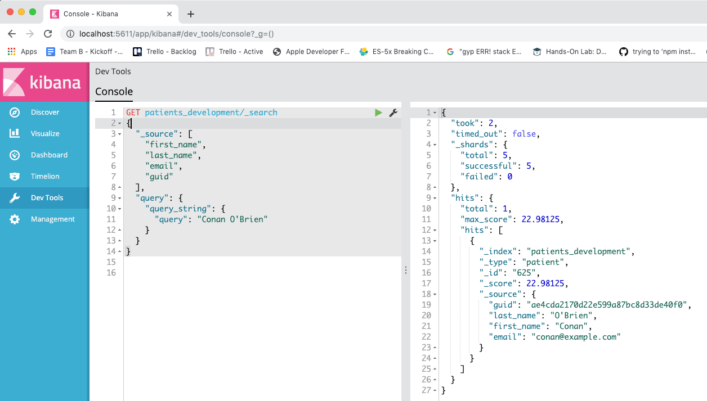

# Interacting with Elasticsearch

- Two main ways, *curl* and *kibana*

## Bash Console CURL function
  - The payload can be passed in with the `-d` tag:

    ```bash
    ~/src/es_notes(master)
    $ curl -s -X GET localhost:9211/patients_development/_search?pretty -d "{ \"_source\": [\"first_name\", \"last_name\", \"email\", \"guid\"], \"query\": { \"query_string\": { \"query\": \"Conan O'Brien\" } } }"
    {
      "took" : 3,
      "timed_out" : false,
      "_shards" : {
        "total" : 5,
        "successful" : 5,
        "failed" : 0
      },
      "hits" : {
        "total" : 1,
        "max_score" : 22.98125,
        "hits" : [
          {
            "_index" : "patients_development",
            "_type" : "patient",
            "_id" : "625",
            "_score" : 22.98125,
            "_source" : {
              "guid" : "ae4cda2170d22e599a87bc8d33de40f0",
              "last_name" : "O'Brien",
              "first_name" : "Conan",
              "email" : "conan@example.com"
            }
          }
        ]
      }
    }
    ```

## Kibana Environment

  - Kibana is a much cleaner way to work.  I recommend it.  The payload is placed directly underneath the URL.  Each node of the JSON requests and responses can be collapsed and expanded.  Far more pleasing to work with than the bash console.

    

  - It also helps you autocomplete the fields

    

## Interacting Via The Rails Console

  - If we want to make any back end changes to elasticsearch, we're going to need to do it through our Rails application.  We use an light wrapper around the elasticsearch gem.  We call the wrapper class `Es::Base`.  The elasticsearch client can be accessed by `Es::Base.client`.  There's a whole level of methods that we can call on that client, but the documentation of the gem is not great.  I've found it's easier use the `perform_request` method to make a call directly:

    ```rb
    # method is one of ['GET', 'POST', 'PUT', 'DELETE', 'HEAD']
    # path is the same path you'd type into kibana.  Everything after localhost:9211/ and before the question mark in curl
    # params (optional) are the qurey parameters, such as { pretty: true }
    # body (optional) is the body of the request, such as { query: { query_string: { query: "Conan' O'Brien" } } }
    # headers (optional) are the same '-H' tags you'd send to curl.  I haven't needed them yet.

    Es::Base.client.perform_request(method, path, params, body, headers)
    ```

     ```sh
    ~/src/icisstaff(zel-chirp-ed-elasticsearch *)
    $ bin/rails c
    Loading development environment (Rails 5.2.3)
    [1] pry(main)> Es::Base.client.perform_request('GET', '', {}, {})
    curl -X GET 'http://localhost:9200/?pretty' -d '{}
    '

    # 2019-10-20T14:16:24+00:00 [200] (0.059s)
    #
    # {
    #   "name":"UluhRfZ",
    #   "cluster_name":"elasticsearch",
    #   "cluster_uuid":"G8IBRVeoRDWBNI294tbjDQ",
    #   "version":{
    #     "number":"5.1.1",
    #     "build_hash":"5395e21",
    #     "build_date":"2016-12-06T12:36:15.409Z",
    #     "build_snapshot":false,
    #     "lucene_version":"6.3.0"
    #   },
    #   "tagline":"You Know, for Search"
    #
    # }


    => #<Elasticsearch::Transport::Transport::Response:0x00007fa596b82b60
     @body=
      {"name"=>"UluhRfZ",
       "cluster_name"=>"elasticsearch",
       "cluster_uuid"=>"G8IBRVeoRDWBNI294tbjDQ",
       "version"=>{"number"=>"5.1.1", "build_hash"=>"5395e21", "build_date"=>"2016-12-06T12:36:15.409Z", "build_snapshot"=>false, "lucene_version"=>"6.3.0"},
       "tagline"=>"You Know, for Search"},
     @headers={"content-type"=>"application/json; charset=UTF-8", "content-encoding"=>"gzip", "transfer-encoding"=>"chunked"},
     @status=200>
    ```
