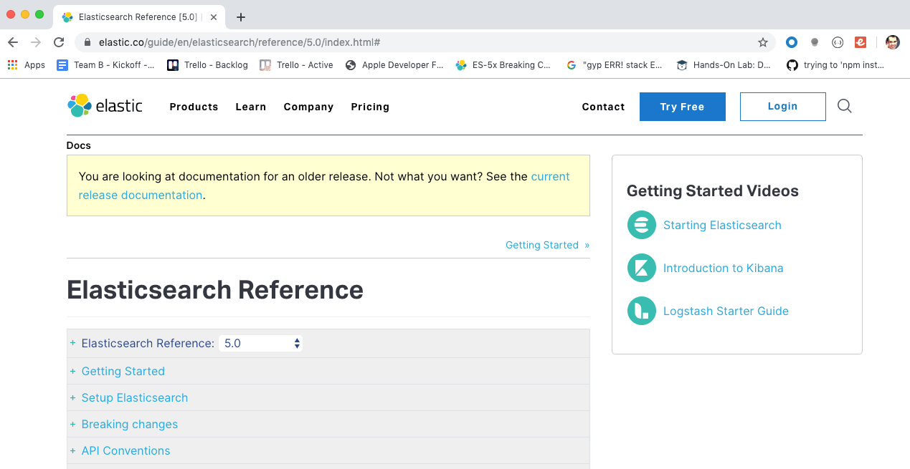
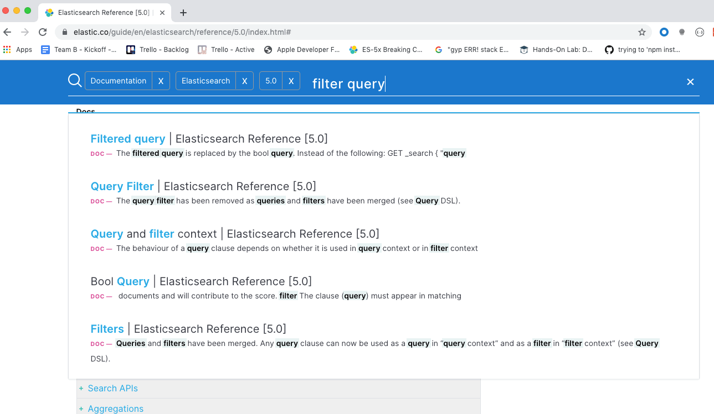

# Learning Resources

### Official Docs

 - The online [documentation](https://www.elastic.co/guide/en/elasticsearch/reference/5.0/index.html) for elasticsearch is excellent

    

  - As expected, the documentation is highly searchable, just click on the magnifying glass at the top right

    

### YouTube/Conference Videos

  - [ElasticSearch in action - Thijs Feryn](https://www.youtube.com/watch?v=oPObRc8tHgQ)
    - Dense with information.  I've watched this video several times as my ES knowledge has deepened.
    - (There's one unnecessary, cringeworthy slide in this presentation 11 minutes in.  The rest of the presentation was informative enough that I'm including the video here despite it.)

### Up Next [Basic Exercises](../README.md#basic-exercises)
