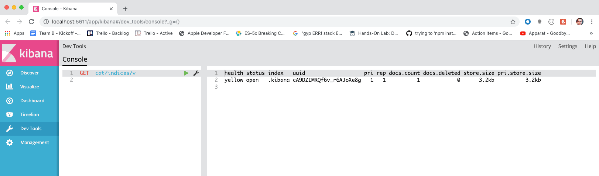
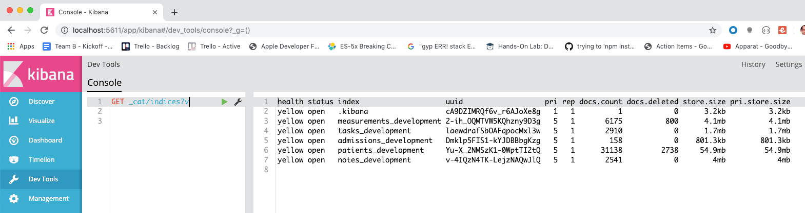

# Installation Guide

- I've taken screen shots of my bash terminal to make the instructions clear.
- Everything that starts with a _$_ dollar sign is a command that you type.
- Everything else is the results you should see in your own terminal screen.

### Download this git repository

```sh
~/src
$ cd ~/src/
~/src
$ git clone git@github.com:zelaznik/es_notes.git
Cloning into 'es_notes'...
remote: Enumerating objects: 48, done.
remote: Counting objects: 100% (48/48), done.
remote: Compressing objects: 100% (44/44), done.
remote: Total 48 (delta 18), reused 7 (delta 1), pack-reused 0
Receiving objects: 100% (48/48), 362.24 KiB | 2.41 MiB/s, done.
Resolving deltas: 100% (18/18), done.
```

### Start up the docker images

 
```sh
$ cd ~/src/es_notes/
~/src/es_notes(master)
$ docker-compose up -d
Creating network "es_notes_default" with the default driver
Creating volume "es_notes_elasticsearch-chirp-ed" with default driver
Creating volume "es_notes_elasticsearch-chirp-ed-logs" with default driver
Creating es_notes_kibana_chirp_ed_1        ... done
Creating es_notes_elasticsearch_chirp_ed_1 ... done
```

### Check that docker is running special containers for both elasticsearch and kibana.

- You should see two container names `es_notes_kibana_chirp_ed_1` and `es_notes_elasticsearch_chirp_ed_1`.

```sh
~/src/es_notes(master)
$ docker container ls
CONTAINER ID        IMAGE                               COMMAND                  CREATED              STATUS              PORTS                                                                                        NAMES
e1348397f01b        kibana:5.1.1                        "/docker-entrypoint.…"   12 seconds ago       Up 10 seconds       0.0.0.0:5611->5601/tcp                                                                       es_notes_kibana_chirp_ed_1
445299333c41        elasticsearch:5.1.1-alpine          "/docker-entrypoint.…"   12 seconds ago       Up 10 seconds       0.0.0.0:9211->9200/tcp, 0.0.0.0:9311->9300/tcp                                               es_notes_elasticsearch_chirp_ed_1
684faad37ab0        kibana:4.6.6                        "/docker-entrypoint.…"   About a minute ago   Up About a minute   0.0.0.0:5601->5601/tcp                                                                       chirpstrap_kibana_1
70d3070bf530        elasticsearch:2.4-alpine            "/docker-entrypoint.…"   About a minute ago   Up About a minute   0.0.0.0:9200->9200/tcp, 9300/tcp                                                             chirpstrap_elasticsearch_1
fbd6110a4977        postgres:9.4.21-alpine              "docker-entrypoint.s…"   7 days ago           Up 17 minutes       0.0.0.0:5432->5432/tcp                                                                       chirpstrap_db_1
7637c8b2d433        rabbitmq:3.6.15-management-alpine   "docker-entrypoint.s…"   7 days ago           Up 17 minutes       4369/tcp, 5671/tcp, 0.0.0.0:5672->5672/tcp, 15671/tcp, 25672/tcp, 0.0.0.0:15672->15672/tcp   chirpstrap_rabbitmq_1
d80848840c40        redis:3.2.6-alpine                  "docker-entrypoint.s…"   7 days ago           Up 17 minutes       0.0.0.0:6379->6379/tcp                                                                       chirpstrap_redis_1
```

### Verify that elasticsearch is working

```sh
~/src
$ curl -s localhost:9211
{
  "name" : "63hMxVV",
  "cluster_name" : "elasticsearch",
  "cluster_uuid" : "QawBbRnsStOZ1kSW9ujzOQ",
  "version" : {
    "number" : "5.1.1",
    "build_hash" : "5395e21",
    "build_date" : "2016-12-06T12:36:15.409Z",
    "build_snapshot" : false,
    "lucene_version" : "6.3.0"
  },
  "tagline" : "You Know, for Search"
}
```
    
### Check Kibana is working
 - Open [http://localhost:5611/app/kibana#/dev_tools/console?_g=()](http://localhost:5611/app/kibana#/dev_tools/console?_g=%28%29) in your browser
 - Hit the green "play" triangle.  The output should look like this



### Seed Elasticsearch With Chirp Development Data
  - Switch to the chirp directory
  - Run a series of rake tasks.
  - MAKE SURE TO SET THE ENVIRONMENT VARIABLES TO POINT TO OUR VERSION OF ELASTIC
  - This process took me start to finish 2 minutes and 35 seconds

    ```sh
    ELASTICSEARCH_URL=http://localhost:9211 bin/rake es:index_tasks es:index_patients es:index_notes es:index_admissions es:index_measurements
    ```

  - Here's a more human readable version of the same comand:

    ```sh
    ~/src/icisstaff(master)
    $ ELASTICSEARCH_URL=http://localhost:9211 bin/rake \
    > es:index_tasks \
    > es:index_patients \
    > es:index_notes \
    > es:index_admissions \
    > es:index_measurements
    ```

   - Now let's check kibana again, click on the green triangle, and we should see the following


