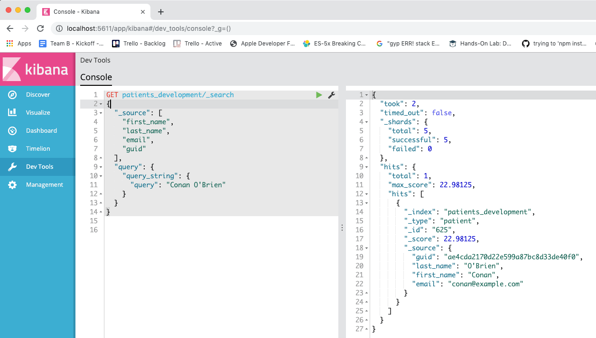

# Interacting with Elasticsearch

- Two main ways, *curl* and *kibana*

## Bash Console CURL function
  - The payload can be passed in with the `-d` tag:

    ```bash
    ~/src/es_notes(master)
    $ curl -s -X GET localhost:9211/patients_development/_search?pretty -d "{ \"_source\": [\"first_name\", \"last_name\", \"email\", \"guid\"], \"query\": { \"query_string\": { \"query\": \"Conan O'Brien\" } } }"
    {
      "took" : 3,
      "timed_out" : false,
      "_shards" : {
        "total" : 5,
        "successful" : 5,
        "failed" : 0
      },
      "hits" : {
        "total" : 1,
        "max_score" : 22.98125,
        "hits" : [
          {
            "_index" : "patients_development",
            "_type" : "patient",
            "_id" : "625",
            "_score" : 22.98125,
            "_source" : {
              "guid" : "ae4cda2170d22e599a87bc8d33de40f0",
              "last_name" : "O'Brien",
              "first_name" : "Conan",
              "email" : "conan@example.com"
            }
          }
        ]
      }
    }
    ```

    - Kibana is a much cleaner way to work.  I recommend it.  The payload is placed directly underneath the URL.  Each node of the JSON requests and responses can be collapsed and expanded.  Far more pleasing to work with than the bash console.

    


