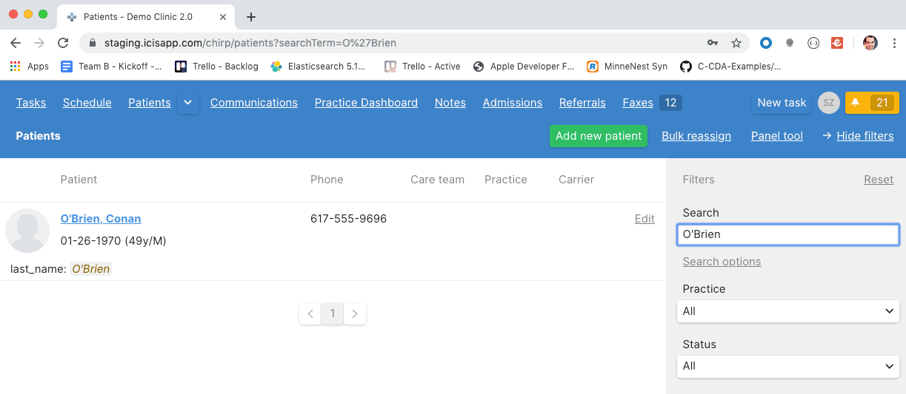

# Ignore Punctuation In Patient Search

- This is a chance to take all the building blocks and apply it to a real world problem in our backlog.
- When a user types in a patient, they'd like to be able to get a search result even if they don't type in a special character.
- In our staging app, the main example is "Conan O'Brien".
- A user has to rembember the apostrophe.

    

### Up Next [Setting Up Your Development Environment](setup.md)
